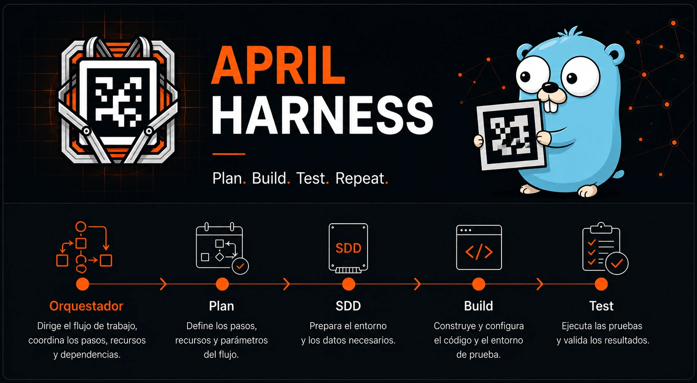

<p align="center">
  
</p>

# April Agent Harness — `apil`

> CLI que scaffoldea un repositorio listo para **Spec-Driven Development (SDD)**
> asistido por agentes de IA (Claude Code).

`apil init` deja en tu proyecto el arnés completo: subagentes definidos
(orquestador, planner, spec author, developer, reviewer), el manifiesto de
features, los documentos de proceso y los scripts de verificación. A partir de
ahí el flujo `pending → spec → aprobación humana → implementación → review → done`
lo conduce el agente, no tú.

Este repositorio se **dogfoodea a sí mismo**: el arnés que instala es el mismo
que usa para desarrollarse.

---

## Instalación

### Requisitos de instalación

- SO: `linux` o `darwin` (macOS). Arquitectura: `amd64` o `arm64`.
- `curl` disponible en el sistema.
- Sin `sudo`: instala a nivel de usuario, no toca rutas del sistema.

### Instalación

```bash
curl -fsSL https://raw.githubusercontent.com/AlvaroEng98/April-Agent-harness/main/install.sh | sh
```

Instala en `~/.local/bin/apil`. El script detecta OS y arquitectura,
resuelve la última release, verifica el checksum SHA-256 contra
`checksums.txt` y avisa si `~/.local/bin` no está en el `PATH`.

Variables de entorno:

| Variable | Efecto |
|----------|--------|
| `VERSION` | Instala una versión concreta en lugar de la última (`VERSION=0.3.4`). Solo `v0.3.4` en adelante lleva el binario renombrado a `apil`; versiones anteriores publicaban `harness` y no son instalables con este script. |
| `BIN_DIR` | Cambia el directorio destino (`BIN_DIR=~/bin`) |

```bash
curl -fsSL https://raw.githubusercontent.com/AlvaroEng98/April-Agent-harness/main/install.sh \
  | VERSION=0.3.4 BIN_DIR=~/bin sh
```

### Requisitos del proyecto scaffoldeado

El binario no tiene dependencias, pero el arnés que instala sí:

| Requisito | Para qué |
|-----------|----------|
| `bash` | `init.sh`, `.claude/hooks/recap.sh` |
| `python3` | validación de `feature_list.json` y specs en `init.sh` |
| Claude Code (o agente compatible) | lee `.claude/agents/` y `AGENT.md` |

---

## Uso

```bash
apil init mi-proyecto   # scaffoldea en ./mi-proyecto (lo crea si no existe)
apil init .             # scaffoldea en el directorio actual
apil init               # equivalente a `apil init .`
```

| Comando | Qué hace |
|---------|----------|
| `apil init [dir]` | Genera la estructura del arnés en `dir` (por defecto `.`) |
| `apil version` | Imprime la versión (`-v`, `--version`) |
| `apil help` | Muestra la ayuda (`-h`, `--help`) |

### Comportamiento sobre un directorio no vacío

- Si detecta un arnés previo (`AGENT.md` o `feature_list.json` presentes),
  **borra y regenera `.claude/agents/`** para que las definiciones de subagentes
  queden actualizadas. Úsalo para actualizar el arnés de un proyecto existente.
- `.gitignore` **se fusiona**: agrega las entradas del template que falten y
  conserva las tuyas.
- El resto de los archivos del template **se sobrescriben**. Si tienes trabajo
  en `feature_list.json`, `progress/` o `docs/`, respáldalo antes.

### Primeros pasos tras el `init`

```bash
cd mi-proyecto
./init.sh          # verifica el entorno — debe salir todo [OK]
```

Después abre Claude Code en el directorio. La feature semilla
`bootstrap_project` hace que el orquestador te entreviste (objetivo + tech
stack), escriba `progress/project-definition.md` y lance `planner_agent` para
poblar el backlog.

---

## Qué genera `apil init`

```
├── .claude/
│   ├── agents/            5 subagentes: orquestador, planner, spec author,
│   │                      developer, reviewer
│   ├── hooks/             recap.sh — recap de estado, hook SessionStart
│   └── settings.json      permisos + registro del hook
├── docs/
│   ├── architecture.md    qué significa "hacer un buen trabajo" aquí
│   ├── conventions.md     estilo, nombres, estructura
│   └── verification.md    cómo verificar el trabajo (incluye trazabilidad)
├── progress/
│   ├── current.md         estado de la sesión en curso
│   └── history.md         bitácora append-only de sesiones cerradas
├── specs/                 (vacío) specs por feature: requirements/design/tasks
├── src/                   (vacío) código de la aplicación
├── tests/                 (vacío) tests automáticos
├── AGENT.md               mapa de navegación para el agente
├── CLAUDE.md              rol obligatorio del hilo principal: orquestador
├── CHECKPOINTS.md         criterios objetivos C1–C7 para cerrar una feature
├── feature_list.json      manifiesto de features con estado
├── session-handoff.md     plantilla de traspaso entre sesiones
├── init.sh                verificación del entorno (ejecutable)
└── .gitignore
```

## El flujo

```
[FASE Grill: el orquestador entrevista]  ← solo si bootstrap_project no está done
       │
       ▼  progress/project-definition.md
[planner_agent]  ← descompone en features
       │
       ▼
pending → [sdd_agent_author] → spec_ready → ⏸ APROBACIÓN HUMANA
       → in_progress → [agent_developer → reviewer_agent] → done
```

Dos puertas que el agente no puede saltar: la **aprobación humana del spec**
antes de escribir código, y la **aprobación humana del review** antes de marcar
`done`. Las features con `"sdd": true` requieren los tres documentos
(`requirements.md`, `design.md`, `tasks.md`) antes de que exista una línea de
código.

Detalle completo en el `AGENT.md` del proyecto generado (§4) y en
`docs/specs.md` de este repositorio.

---

## Desarrollo de este repositorio

Requiere Go `1.25.0` o superior instalado ([go.dev/dl](https://go.dev/dl/)).

```bash
./init.sh        # verifica el arnés + compila
go test ./...    # tests
go build -o apil . && ./apil init /tmp/prueba-harness   # smoke test
```

### Dónde vive qué

- **Raíz** (`feature_list.json`, `progress/`, `docs/`): estado de trabajo *de
  este repo*. `feature_list.json` y `progress/*.md` están gitignoreados a
  propósito — son estado de desarrollo, no producto.
- **`templates/`**: el **lienzo limpio** de esos mismos archivos, lo que se
  embebe y se copia al proyecto destino. Si quieres cambiar lo que reciben los
  usuarios, edita aquí.
- El resto de los archivos embebidos (`.claude/` —incluido `.claude/hooks/recap.sh`—,
  `AGENT.md`, `CLAUDE.md`, `init.sh`, …) se toman de la raíz tal cual: son
  idénticos en este repo y en el proyecto generado.

La lista exacta de lo que se embebe está en la directiva `go:embed` de
`main.go`. `templates/` se embebe entero, así que un archivo nuevo ahí entra
automáticamente al scaffold.

### Release

1. Feature aprobada como `done` → `./sync-changelog.sh` la vuelca a la sección
   `## [Unreleased]` de `CHANGELOG.md`.
2. Renombra `## [Unreleased]` a `## [X.Y.Z] - dd/mm/aaaa` y commitea.
3. `git tag vX.Y.Z && git push origin vX.Y.Z`.

El workflow `.github/workflows/release.yml` corre los tests (si fallan, no hay
release), extrae las notas de la versión con `./release-notes.sh` y lanza
goreleaser. Las notas salen **siempre** de `CHANGELOG.md`, nunca de
`feature_list.json` (que no está en el checkout de CI).
